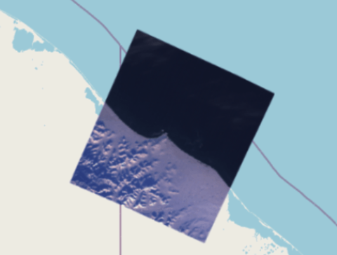
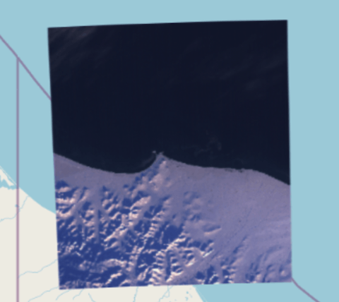

# Rotated GeoTIFF

## Sample

**expected view**  


**ModelTransformation**

```json
[
  8.92997575301205,
  -4.500614786418409,
  0,
  389511.2734,
  -4.500614912499997,
  -8.929975724999965,
  0,
  7697141.2062,
  0,
  0,
  0,
  0,
  0,
  0,
  0,
  1
]
```

**BBOX**

```json
[353506.35510865273, 7592828.9090791, 454735.8163, 7697141.2062]
```

## Example of failure

**ol.source.GeoTIFF(v6.15.0)**  


geotiff.js used within ol don't take rotation into account.

**geotiff.js(v2.0.5)'s getBoundingBox**

```json
[389511.2734, 7625701.400400001, 454735.8163, 7697141.2062]
```
