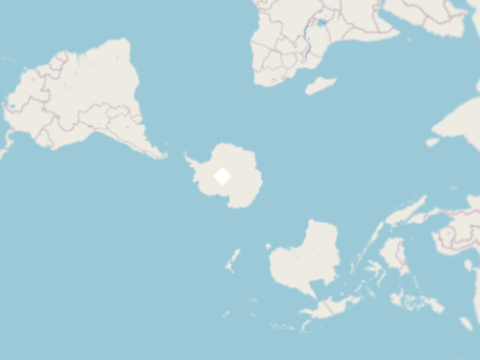

# Reprojected ImageStatic

ol.source.ImageStatic(v6.15.0) fails in some cases.

## Example of success

**Source Extent**  
[160, -10, 190, 20]

**Source Projection**  
EPSG:4326

**View Projection**  
EPSG:4326

## Example of failure 1

Image is cut off at the antimeridian.

**Source Extent**  
[160, -10, 190, 20]

**Source Projection**  
EPSG:4326

**View Projection**  
EPSG:3857

## Example of failure 2

Image is not displayed. It should be on the lower right.

**Source Extent**  
[140, -10, 170, 20]

**Source Projection**  
EPSG:4326

**View Projection**  
EPSG:3031
